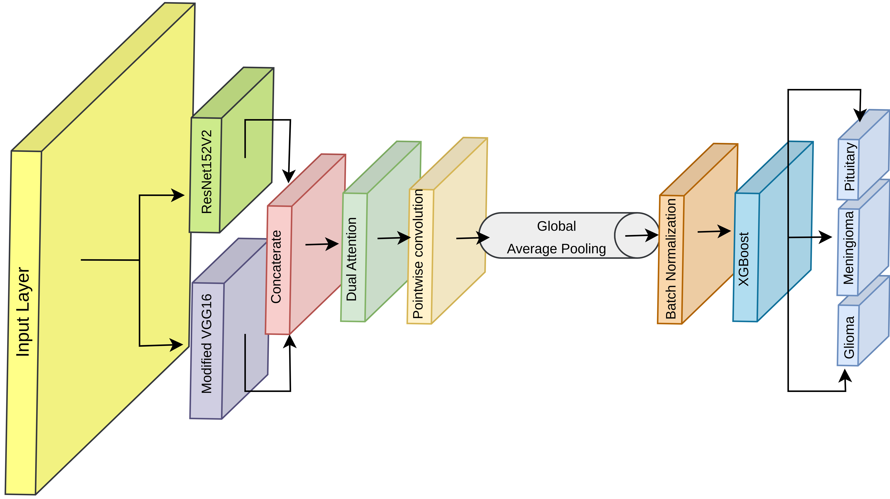
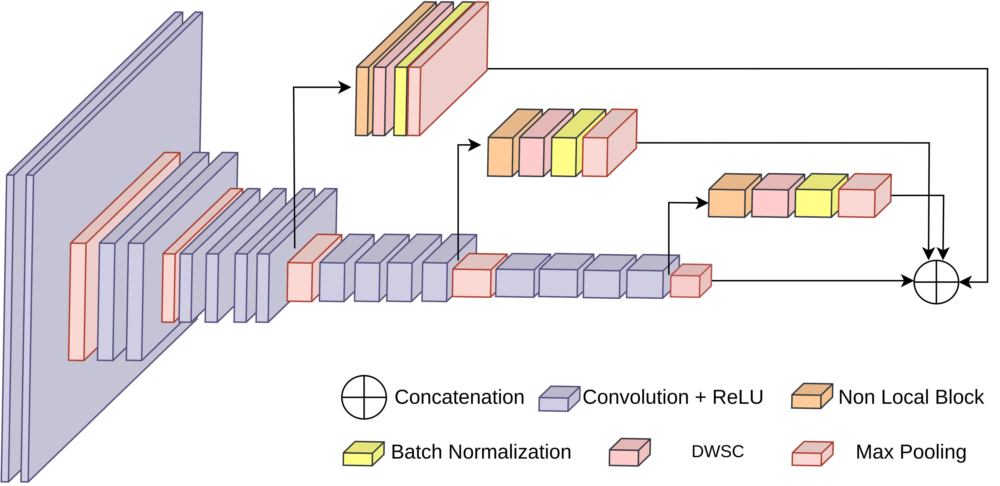

# Brain Tumor Classification With Deep Fusion Model

This repository contains the code and resources for a deep learning model designed to classify brain tumor images. The model utilizes a fusion of ResNet152V2 and a modified VGG16 architecture to achieve efficient and accurate classification.

## Model Architecture

## Modified VGG16

## Dataset Sample

## Dataset
The dataset used in this project can be accessed on [Figshare](https://figshare.com/articles/dataset/brain_tumor_dataset/1512427/5). Please download it from the provided link.

## Notebooks
The "Notebooks" directory contains experimental notebooks showcasing the model's training and evaluation.

## Dependencies
To set up the required Python environment, refer to the "requirements.txt" file for a list of dependencies and installation instructions.

Feel free to explore the code and resources to better understand the brain tumor classification using a deep fusion model. If you have any questions or feedback, please don't hesitate to reach out.
